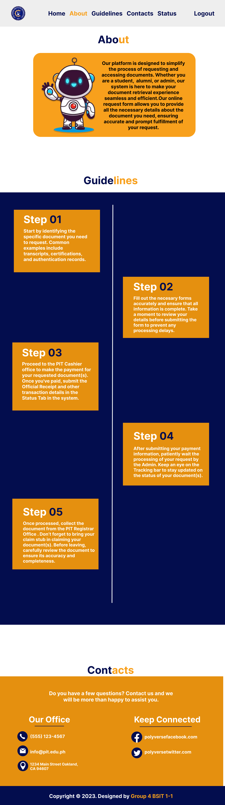

<h1 style="color: #1E90FF;"> Online Document Request System </h1>

<h2 style="color: #FF6347;">📋 Description</h2>

The <strong>Online Document Request System</strong> is a web-based platform designed to streamline the process of requesting and managing various documents. This system provides users with a convenient and secure way to submit document requests, track their status, and receive notifications when their documents are ready.

<h2 style="color: #FF6347;">🎯 Purpose</h2>

The primary purpose of the <strong>Online Document Request System</strong> is to improve the efficiency and accuracy of document handling. By automating the request process, it reduces the workload on administrative staff, minimizes errors, and enhances user satisfaction by providing a transparent and accessible method for managing document requests.

<h2 style="color: #FF6347;">✨ Key Features</h2>
<ul>
  <li><strong>🔑 User Registration and Login</strong>: Secure user authentication and registration process to ensure only authorized users can access the system.</li>
  <li><strong>📊 Tracking System</strong>: Real-time tracking of document requests, allowing users to monitor the status of their submissions.</li>
  <li><strong>📝 Document Request Form</strong>: Easy-to-use form for submitting document requests with required details.</li>
  <li><strong>🔒 Security and Privacy</strong>: Ensures that all user data and documents are handled with the utmost security and confidentiality.</li>
  <li><strong>📂 Document Management</strong>: Efficient management of documents, including storage, retrieval, and processing.</li>
</ul>

<h2 style="color: #FF6347;">🛠️ Tech Stack</h2>
<ul>
  <li><strong>🌐 HTML</strong>: For structuring the web pages.</li>
  <li><strong>🎨 CSS</strong>: For styling the web pages.</li>
  <li><strong>💻 JavaScript</strong>: For adding interactivity to the web pages.</li>
  <li><strong>🐘 PHP</strong>: For server-side scripting and handling backend operations.</li>
  <li><strong>🗃️ HeidiSQL</strong>: For managing the database.</li>
</ul>

<h2 style="color: #FF6347;">🖼️ Website Preview</h2>

Here is a preview of the Online Document Request System:

